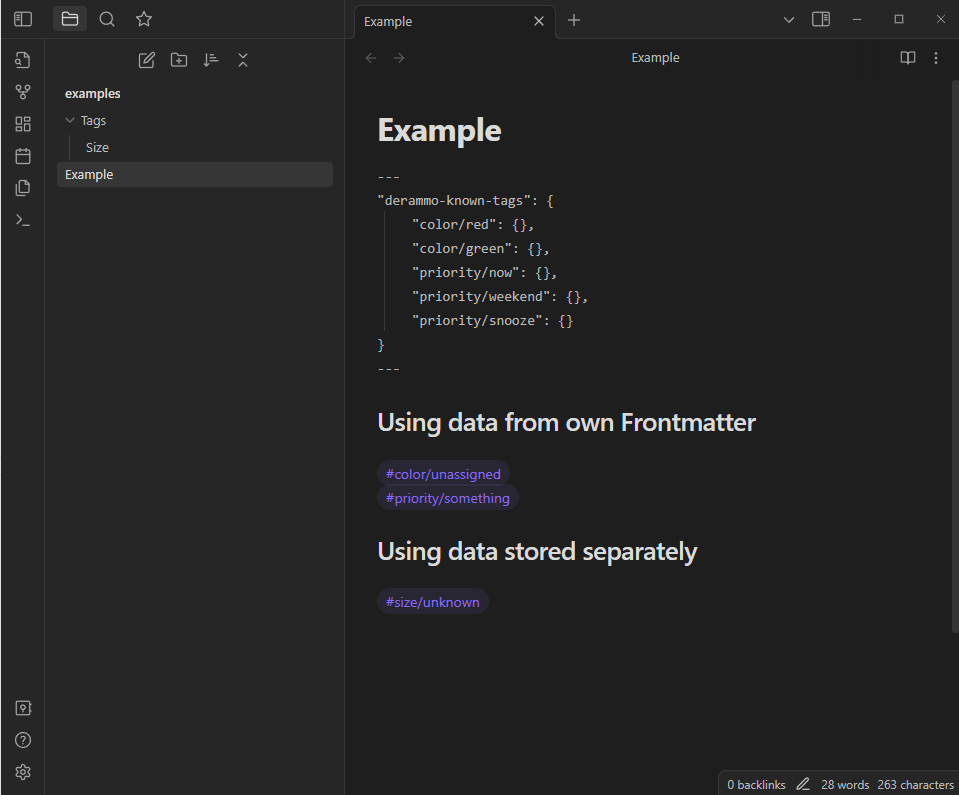

# Known Tags Plugin

Provides inline commands for UI elements to quickly select subtags (tags of the form `#A/B`) declared in frontmatter, either in the same file or another file.



# Command: known-tags

```
#tag/subtag `!known-tags [combo] [erase] [nohide] [nodim] [hide] [dim]`
```

Operates as shown in demo above.

# Bonus Command: erase-quote

```
> some text here `!erase-quote [nohide] [nodim] [hide] [dim]`
```

Provides a button to delete the quote text on the same line, preceding the command.  This isn't generatlly useful, except that I store facts in individual quoted lines and I needed this UI.  Not really related to the rest of this plugin.

# Installation

Download submodules and install dependencies:

`npm install`

Build plugin and copy latest version to demo vault in `examples` folder.

`npm run update-examples`
